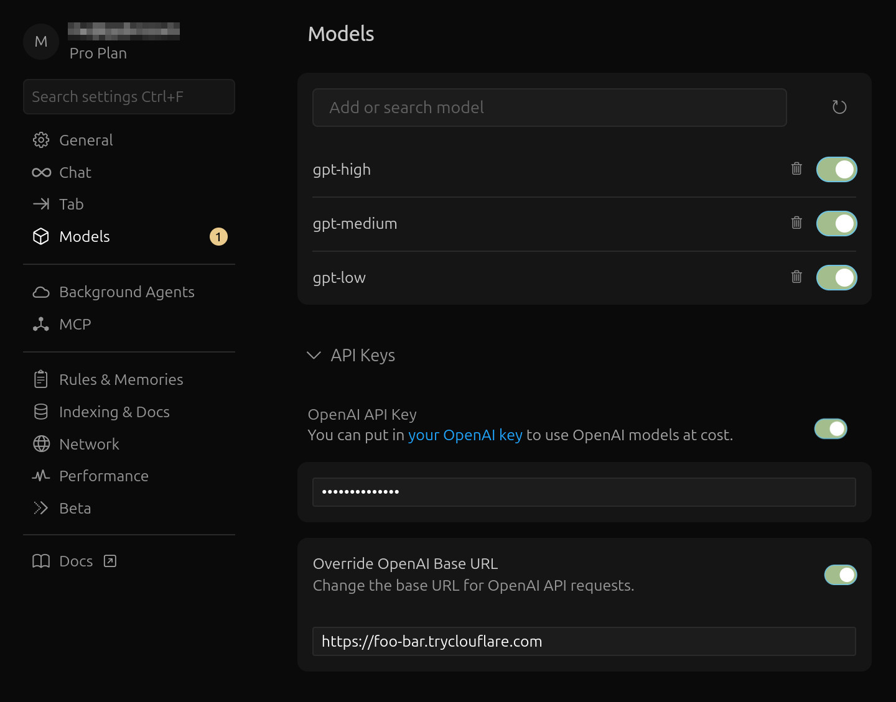
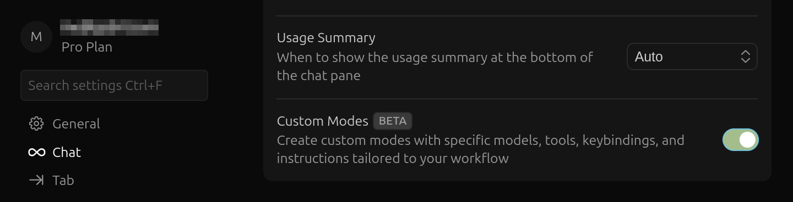

# Cursor Azure GPT-5

[](#)
[](#)
[](#)
[](#)


A service that allows Cursor to use Azure GPT-5 deployments by:
 - Adapting incoming Cursor **completions API** requests to the **Responses API**
 - Forwarding the requests to Azure
 - Adapting outgoing Azure **Responses API** streams into **completions API** streams

This project originates from Cursor's lack of support for Azure models that are only served through the **Responses API**. It will hopefully become obsolete as Cursor continues to improve its model support.

## Feature highlights

- Switching between `high`/`medium`/`low` reasoning effort levels by selecting different models in Cursor.
- Configuring different _reasoning summary_ levels.
- Displaying _reasoning summaries_ in Cursor natively, like any other reasoning model.
- Production-ready, so you can share the service among different users in an organization.
- When running from a terminal, [rich](https://github.com/Textualize/rich) logging of the model's context on every request, including Markdown rendering, syntax highlighting, tool calls/outputs, and more.

Upcoming features:
- Multimodal: Will be implemented as soon as better testing is in place and there is demand (PRs welcome).
- Multiple models simultaneously: Even Cursor's Azure configuration only supports a single deployment at a time. It would be fairly easy to implement support for multiple models in this service, covering even more needs.
- Full test coverage: See the [Testing](#testing) section for an explanation of the current low coverage.

Feel free to create or vote on any [project issues](https://github.com/gabrii/Cursor-Azure-GPT-5/issues), and star the project to show your support.

## Quick start

If you prefer to deploy the service (for example, to allow multiple members of your team to use it), check the [Production](#production) section, as the project comes with production-ready containers using `supervisord` and `gunicorn`.

### 1. Service configuration

Make a copy of the file `.env.example` as `.env` and update the following flags as needed:

| Flag                  | Description                                                                                                                    | Default     |
| --------------------- | ------------------------------------------------------------------------------------------------------------------------------ | ----------- |
| `AZURE_BASE_URL`      | Your Azure OpenAI endpoint base URL (no trailing slash), e.g. `https://<resource>.openai.azure.com`.                           | required    |
| `AZURE_API_KEY`       | Azure OpenAI API key.                                                                                                          | required    |
| `AZURE_DEPLOYMENT`    | Name of the Azure model deployment to use.                                                                                     | `gpt-5`     |
| `SERVICE_API_KEY`     | Arbitrary API key to protect your service. Set it to a random string.                                                          | `change-me` |
| `AZURE_SUMMARY_LEVEL` | Set to `none` to disable summaries. You might have to disable them if your organization hasn't been approved for this feature. | `detailed`  |

Alternatively, you can pass them through the environment where you run the application.

<details>
<summary>Optional Configuration</summary>

| Flag                | Description                                                            | Default              |
| ------------------- | ---------------------------------------------------------------------- | -------------------- |
| `AZURE_API_VERSION` | Azure OpenAI Responses API version to call.                            | `2025-04-01-preview` |
| `AZURE_TRUNCATION`  | Truncation strategy for long inputs.                                   | `auto`               |
| `FLASK_ENV`         | Flask environment. Use `development` for dev or `production` for prod. | `production`         |
| `RECORD_TRAFFIC`    | Toggle writing request/response traffic to `recordings/`               | `off`                |

</details>

### 2. Exposing the service

<details>
<summary>Why do I have to?</summary>

> Since Cursor routes requests through its external prompt-building service rather than directly from the IDE to your API, your custom endpoint must be publicly reachable on the Internet.
>
> Consider using Cloudflare because its tunnels are free and require no account.
</details>

[Install `cloudflared`](https://developers.cloudflare.com/cloudflare-one/connections/connect-networks/downloads/) and run:

```bash
cloudflared tunnel --url http://localhost:8080
```

Copy the URL of your tunnel from the output of the command. It looks something like this:

```text
+----------------------------------------------------+
|  Your quick Tunnel has been created! Visit it at:  |
|  https://foo-bar.trycloudflare.com                 |
+----------------------------------------------------+
```

Then paste it into _Cursor Settings > Models > API Keys > OpenAI API Key > Override OpenAI Base URL_:



### 3. Configuring Cursor

In addition to updating the OpenAI Base URL, you need to:

1. Set _OpenAI API Key_ to the value of `SERVICE_API_KEY` in your `.env`

2. Ensure the toggles for both options are **on**, as shown in the previous image.

3. Add the custom models called exactly `gpt-high`, `gpt-medium`, and `gpt-low`, as shown in the previous image. You can also create `gpt-minimal` for minimal reasoning effort. You don't need to remove other models.

<details>
<summary>Additional steps if you face this error:
    
</summary>

> This is a bug on Cursor's side when custom models edit files in **∞ Agent** mode. Regardless of the model, and even if `edit_file` is working correctly, Cursor may show this pop-up and interrupt generation after the first `edit_file` function call.
>
> This only happens when using model names Cursor has not allowlisted or prepared for, such as `gpt-high`. However, we can't use the standard model names such as `gpt-5-high` because Cursor does not route those to custom OpenAI Base URLs.
>
> For now, this bug can be bypassed by using the Custom Modes beta
>
> In the near future, either the bug in Agent mode will be fixed or those two remaining functions will be added to Custom Modes—or, even better, Azure support will improve enough to render this project obsolete.

4. Enable Custom Modes Beta in _Cursor Settings > Chat_: 

5. Create a custom mode:

    

</details>

### 4. Running the service

To run the production version of the app:

```bash
docker compose up flask-prod
```

> For instructions on how to run locally without Docker, and the different development commands, see the [Development](#development) section.

## Development

### Running locally

<details><summary>Expand</summary>

#### Bootstrap your local environment

```bash
python -m venv .venv
pip install -r requirements/dev.txt
```

#### Running the development server

```bash
flask run -p 8080
```

#### Running the production server*

```bash
export FLASK_ENV=production
export FLASK_DEBUG=0
export LOG_LEVEL=info
flask run -p 8080
```

This will only run the Flask server with the production settings. For a closer approximation of the production server running with `supervisord` and `gunicorn`, check [Running with Docker](#running-with-docker).

#### Running tests

```bash
flask test
```

To run only specific tests, you can use the pytest `-k` argument:

```bash
flask test -k ...
```

#### Running linter

```bash
flask lint
```

The `lint` command will attempt to fix any linting/style errors in the code. If you only want to know if the code will pass CI and do not wish for the linter to make changes, add the `--check` argument.

```bash
flask lint --check
```

</details>

### Running with Docker

<details><summary>Expand</summary>

#### Running the development server

```bash
docker compose up flask-dev
```

#### Running the production server

```bash
docker compose up flask-prod
```

This image runs the server through `supervisord` and `gunicorn`. See the [Production](#production) section for more details.

When running flask-prod, the production flags are set in `docker-compose.yml`:

```yml
    FLASK_ENV: production
    FLASK_DEBUG: 0
    LOG_LEVEL: info
    GUNICORN_WORKERS: 4
```

The list of `environment:` variables in the `docker-compose.yml` file takes precedence over any variables specified in `.env`.

#### Running tests

```bash
docker compose run --rm manage test
```

To run only specific tests, you can use the pytest `-k` argument:

```bash
docker compose run --rm manage test -k ...
```

#### Running linter

```bash
docker compose run --rm manage lint
```

The `lint` command will attempt to fix any linting/style errors in the code. If you only want to know if the code will pass CI and do not wish for the linter to make changes, add the `--check` argument.

```bash
docker compose run --rm manage lint --check
```

</details>

## Testing

Currently, testing and coverage for the project are nonexistent. Only the test skeletons, configuration, commands, and a test-friendly architecture are in place.

To make the generation of test fixtures easier, the `RECORD_TRAFFIC` flag has been added, which creates files with all the incoming/outgoing traffic between this service and Cursor/Azure.

Currently, those fixtures would include sensitive data, such as system prompts, tools, and the entire scaffolding from Cursor's prompt-building service.

To avoid violating Cursor's intellectual property, a redaction layer will have to be implemented so the recorded traffic can be published and used in tests while remaining MIT-licensed.

This is a top priority and will be developed next, before any other features, as traffic recording will also be a valuable tool for users of the service to report issues on GitHub and to improve testing for other contributors to confidently contribute to the project.

## Production

<details><summary>Expand</summary>

### Configure server

You might want to review and modify the following configuration files:

| File                                    | Description                                                                                                     |
| --------------------------------------- | --------------------------------------------------------------------------------------------------------------- |
| `supervisord/gunicorn.conf`             | Supervisor program config for Gunicorn (bind :5000, gevent; workers/log level from env; logs to stdout/stderr). |
| `supervisord/supervisord_entrypoint.sh` | Container entrypoint that execs supervisord (prepends it when args start with -).                               |
| `supervisord/supervisord.conf`          | Main Supervisord config: socket, logging, nodaemon; includes conf.d program configs.                            |

### Build, tag, and push the image

```bash
docker compose build flask-prod
docker tag app-production your-tag
docker push your-tag
```

</details>